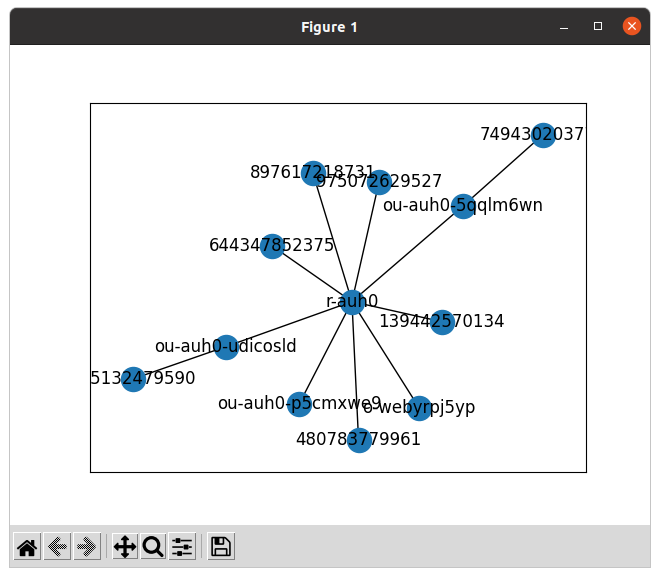

# orgtreepubsub

An experiment to collect the AWS organization tree data using a
publish-subscribe framework. The publish-subscribe pattern makes the code easier
to read and makes it easier to extend for new organizations features.

I chose [Pypubsub](https://pypubsub.readthedocs.io/en/v4.0.3/index.html) for the
publish-subscribe framework because it's stable, well-documented and easy to
use.

orgtreepubsub works like an event-based crawler of the AWS organization
structure.

## Browsing

If you already have an org dump, you can view it like this.

```bash
cat ~/tmp/org.graphml | poetry run python org_browser.py
```

## Dumping

FIXME: Dumping now uses Pickle by default, so I need a new way to export GraphML.

Use `dump_org` to dump the AWS organization graph in [GraphML (Graph Markup
Language)](https://cs.brown.edu/people/rtamassi/gdhandbook/chapters/graphml.pdf).

```bash
poetry run python dump_org.py > ~/tmp/org.graphml
```

Use the dump in any other graph analysis tool.

Example output:

```xml
<?xml version='1.0' encoding='utf8'?>
<graphml xmlns="http://graphml.graphdrawing.org/xmlns" xmlns:xsi="http://www.w3.org/2001/XMLSchema-instance" xsi:schemaLocation="http://graphml.graphdrawing.org/xmlns http://graphml.graphdrawing.org/xmlns/1.0/graphml.xsd">
  <graph edgedefault="undirected">
    <node id="r-auh0" />
    <node id="o-webyrpj5yp" />
    <node id="ou-auh0-udicosld" />
    <node id="ou-auh0-5qqlm6wn" />
    <node id="ou-auh0-p5cmxwe9" />
    <node id="644347852375" />
    <node id="897617218731" />
    <node id="975072629527" />
    <node id="480783779961" />
    <node id="139442570134" />
    <node id="345132479590" />
    <node id="749430203777" />
    <edge source="r-auh0" target="o-webyrpj5yp" />
    <edge source="r-auh0" target="ou-auh0-udicosld" />
    <edge source="r-auh0" target="ou-auh0-5qqlm6wn" />
    <edge source="r-auh0" target="ou-auh0-p5cmxwe9" />
    <edge source="r-auh0" target="644347852375" />
    <edge source="r-auh0" target="897617218731" />
    <edge source="r-auh0" target="975072629527" />
    <edge source="r-auh0" target="480783779961" />
    <edge source="r-auh0" target="139442570134" />
    <edge source="ou-auh0-udicosld" target="345132479590" />
    <edge source="ou-auh0-5qqlm6wn" target="749430203777" />
  </graph>
</graphml>
```

## Drawing

Using networkx's built in drawing it can make very rudimendary drawings of
organization graphs. A small organization is somewhat readable and looks like
this:



## Concurrency

Pypubsub doesn't have built-in support for concurrency, so a naive
implementation will run each AWS API request serially.

The Organizations APIs permit a small amount of concurrent calls. Neither the
concurrency limit nor the throttling limit is documented, but it can definitely
go faster than one request at a time.

### Solution 1

If I just create a thread wherever I need one, I create too many concurrent API
calls. The APIs throttle. Boto3 sometimes fails with throttling errors.

### Solution 2

I can limit the number of concurrent threads by using a ThreadPoolExecutor.

If I create a ThreadPool executor and call submit in place of creating a thread,
the program exits before any pooled thread starts executing. If I add a long
sleep at the end of the main function, the program completes all the expected
work. But it then hangs until the sleep completes. How long is enough? Eaxctly
as long as it takes to do all the work. But how do I know when that happens?

### Solution 3

I can also limit the number of threads by using a bounded work queue to create
threads. Unless the queue is full, the thread will be created as soon as it is
needed. When the queue is full, the queue will block until one of the other
threads completes.

I thought about that, but it seemed to have the same problem as the second
solution.

### Solution 4

Adapt [Stephen Rauch's example](https://stackoverflow.com/a/41654240/111424).
Instead of using a thread, each subscriber adds a task to a queue.

The main function now creates a ThreadPoolExecutor after setting up the
subscribers. The subscribers instead have access to a queue.

After seeding the futures set, the task queue is checked periodically and new
futures are added to the set from it. Completed futures are removed from the
set. When the futures set is empty, the process is complete.

## Performance

In org with ~120 accounts.

With timeout 0.5 seconds.

1 thread : 0m38.304s, 0m38.792s, 0m38.045s.
2 threads: 0m20.093s, 0m20.497s, 0m20.438s.
4 threads: 0m14.830s, 0m15.635s, 0m19.378s.
8 threads: 0m19.897s! 0m18.543s! 0m16.048s.

! indicates at least one TooManyRequestsException was raised.

With timeout 0.1 seconds.

1 thread : 0m40.666s, 0m37.477s, 0m38.662s.
2 threads: 0m19.842s, 0m20.220s, 0m19.906s.
4 threads: 0m15.706s, 0m15.740s, 0m15.496s.
8 threads: 0m16.482s, 0m18.243s, 0m16.125s.

The sweet spot seems to be 4 threads and timeout 0.1 seconds.

The timeout (dequeuing interval) doesn't appear to have much effect. In fact the
timeout is an upper bound. The task loop stops waiting as soon as as the next
future completes. So the interval probably only has an effect on the first
iteration.

## Prior Art

[Orgcrawler](https://github.com/ucopacme/orgcrawler) provides a data model and
methods for querying AWS Organizations resources: accounts, organizational
units, service control policies. It can execute a custom boto3 payload function
in all specified accounts/regions.

It sounds like a combination of this tool and botocove. It appears to be
abandoned, as it was last committed in April 2020 and has no updates to issues
since then.

[org-visualizer](https://github.com/aws-samples/org-visualiser) is an "AWS
Samples" tool to visualise the AWS OU and account structure for a given org just
published on 2022-11-07. The README is spookily similar to this one :-D I'm keen
to see how much investment this one gets from AWS. Will it be good enough to
replace this personal project?

[AWS Data Tools](https://github.com/timoguin/aws-data-tools-py) offers the
OrganizationDataBuilder class to build a full model of an AWS Organization. It
handles recursing the organizational tree and populating any relational data
between the various nodes, e.g., parent-child relationships between an OU and an
account. Parallel operations are not supported, so everything runs serially.

It covers all the resource types (policies for example) but it's serial so may
be slower. The README doesn't show how to interact with the data model. Still, I
like it!

## Drawing Options

An AWS Organiziation can be modelled as a graph. How do you draw a graph?

Networkx has some
[built-in drawing](https://networkx.org/documentation/stable/reference/drawing.html),
but discourages it. It recommends some other tools instead.

> Proper graph visualization is hard, and we highly recommend that people
> visualize their graphs with tools dedicated to that task. Notable examples of
> dedicated and fully-featured graph visualization tools are
> [Cytoscape](http://www.cytoscape.org/), [Gephi](https://gephi.org/), Graphviz
> and, for [LaTeX](http://www.latex-project.org/) typesetting,
> [PGF/TikZ](https://sourceforge.net/projects/pgf/). To use these and other such
> tools, you should export your NetworkX graph into a format that can be read by
> those tools. For example, Cytoscape can read the GraphML format, and so,
> `networkx.write_graphml(G, path)` might be an appropriate choice.

A friend recommends D3 with a
[force-directed graph](https://observablehq.com/@d3/force-directed-graph)
example and [github repo](https://github.com/d3/d3-force).

[Creating beautiful stand-alone interactive D3 charts with Python](https://towardsdatascience.com/creating-beautiful-stand-alone-interactive-d3-charts-with-python-804117cb95a7)

[Charming Data](https://www.youtube.com/c/CharmingData/about) is a Youtube
channel with tutorials for Cytoscape.

> My name is Adam and my passion is Dash Plotly. This channel will help you
> become an expert in Dash and teach you how to use data visualization to create
> beautiful dashboards, market your product, and develop your data science
> career.
>
> Dash is a platform for building powerful web-based interactive apps,
> in pure python. It's gaining hundreds of users daily, so join the family and
> subscribe to this channel for access to weekly video tutorials.

[Dash](https://plotly.com/dash/) apps give a point-&-click interface to models written in Python.

[graph-tool](https://graph-tool.skewed.de/) is another Python graph library
similar to NetworkX. It also has built-in
[drawing functions](https://graph-tool.skewed.de/static/doc/draw.html).

graph-tool promises more complete support for
[I/O using GraphML](https://graph-tool.skewed.de/static/doc/quickstart.html#graph-i-o):
"an exact bit-for-bit representation of all supported Property maps types",
which includes the Python `object` type. But the module is not pip-installable,
so I don't want to explore it just now because it would complicate the set up.

[nxviz](https://github.com/ericmjl/nxviz) is simultaneously a data visualization
research project, art project, and declarative data visualization tool. Its
authors hope you enjoy using it to build beautiful graph visualizations.

## Inspiration

What do I want to draw?

See here for examples.

* [Cytoscape.js Demos](https://js.cytoscape.org/#demos)
* [Gephi intro video](https://gephi.org/videos/)

Click an organizational unit to see its accounts circled around around it like
in the Cytoscape.js Wine and Cheese map.

Click any node to get a pop-up with a link to the Organizations console like in
the Cola.js gene-gene graph.

Click and unclick nodes to extend and retract descendants like in the
Breathfirst layout and images example.

Click a node to update a view of its attributes in a key-value table. (Possible
in Dash?)

Search by any account attribute value (Id, Name, tag value, etc.) to select the
account and its ancestors.

## Ignored properties in dump

The following organization properties are ignored:

*
  [Organization AllowedPolicyTypes](https://docs.aws.amazon.com/organizations/latest/APIReference/API_Organization.html),
  an array of
  [PolicyTypeSummary](https://docs.aws.amazon.com/organizations/latest/APIReference/API_PolicyTypeSummary.html)
  objects.
*
  [Root PolicyTypes](https://docs.aws.amazon.com/organizations/latest/APIReference/API_Root.html),
  an array of PolicyTypeSummary objects.
*
  [Account JoinedTimestamp](https://docs.aws.amazon.com/organizations/latest/APIReference/API_Account.html),
  a Timestamp unmarshalled by boto3 to datetime.

I will find another way to represent these properties when I have a need for
them.

GraphML as implemented by NetworkX supports only simple scalar values such as
strings and numbers. It raises error like this when I attempt to add something
more complex:

> `networkx.exception.NetworkXError: GraphML writer does not support <class
> 'list'> as data values.`
>
> `networkx.exception.NetworkXError: GraphML writer does not support <class
> 'datetime.datetime'> as data values.`

The
[GraphML primer](http://graphml.graphdrawing.org/primer/graphml-primer.html#Attributes)
describes a GraphML-Attributes extension that supports only scalar values.

> With the help of the extension GraphML-Attributes one can specify additional
> information of simple type for the elements of the graph. Simple type means
> that the information is restricted to scalar values, e.g. numerical values and
> strings.

NetworkX has an an open issue to
[improve GraphML support](https://github.com/networkx/networkx/issues/4024).

## Org Graph algorithms

Later I'll add these as functions to the org_graph module.

Setup.

```python
from pprint import pprint
from boto3 import Session
import networkx as nx
from org_graph import get_org_graph
graph = get_org_graph(Session())
```

Find an OU by name.

```python
[id for id, attrs in graph.nodes.items() if attrs.get("Name") == "Suspended"]
```

List OU names.

```python
pprint(
    sorted(
        [
            [attrs["Id"], attrs["Name"]]
            for attrs in graph.nodes.values()
            if attrs["type"] == "organizational_unit"
        ],
        key=lambda n: n[1],
    )
)
```

Count direct descendant accounts of an OU.

```python
sum(
    1
    for child in graph["r-...."]
    if graph.nodes[child]["type"] == "account"
)
```

Count all descendant accounts of an OU.

```python
sum(
    1
    for n in nx.descendants(graph, "r-....")
    if graph.nodes[n]["type"] == "account"
)
```

Get the organization root.

```python
[id for id, attrs in graph.nodes.items() if attrs["type"] == "root"]
```

Get path for account with ID components.

```python
root = next(id for id, attrs in graph.nodes.items() if attrs["type"] == "root")
components = nx.shortest_path(graph, root, "111111111111")
f"/{'/'.join(components)}"
```

Get path for account with name components.

```python
root = next(id for id, attrs in graph.nodes.items() if attrs["type"] == "root")
components = nx.shortest_path(graph, root, "11111111111")
named_components = [graph.nodes[n]["Name"] for n in components]
f"/{'/'.join(named_components)}"
```

Get policies affecting an account.

```python
# TODO: Add policies to graph.
```

Idea: Create an Organization class. Store the graph as a attribute of the
organization. Remove the organization node from the graph. Store the
organization properties in the organization object. I thought about inheriting
from DiGraph directly, but that would be a misuse of inheritance because of
fatal interface bloat and because it conflates the domain class (Organization)
with the implementation class (DiGraph). See Stephen Lowe's
[Composition vs. Inheritance: How to Choose?](https://www.thoughtworks.com/insights/blog/composition-vs-inheritance-how-choose)
for an explanation.

## Org Browser

The org browser GUI is written using Tkinter (Tcl/Tk interface), Python's
built-in GUI framework.

TkDocs.com has an intro to the
[grid geometry manager](https://tkdocs.com/tutorial/grid.html) and puts it in
historical context (pack came first). I like this site; it's like the missing
manual for Tkinter.

I want a table of account rows. The columns are all the properties of the
account and and all the tag keys.

I want a tree of organizational units. The name, the ID, and the number of
accounts in the OU should be visible.

Maybe I want [Miller columns](https://en.wikipedia.org/wiki/Miller_columns). I
first heard about them when reading about Appian's [interface components for
hierarchies](https://docs.appian.com/suite/help/22.1/User_and_Group_Browser_Components.html).

Miller column pros: "In all cases, the technique is appropriate for structures
with high degree (large fanout). For low-degree structures, outline editors or
graph viewers are more effective." The OUs that have accounts have large fanout.
So this might be an appropriate technique.

Miller column cons: "The necessity of horizontal scrollbars when displaying
deeper folder structures". The depth is limited to 5 for OUs, so I think it
won't be a problem. "Sort options and metadata display are limited". To display
metadata, I might need to use other parts of the screen to display properties
and tags.

Tkinter doesn't have a miller columns widget. I tried to build one myself. See
miller_demo.py.

Qt has the [QColumnView](https://doc.qt.io/qt-5/qcolumnview.html) class. This
could be a compelling reason to switch to Qt for the GUI.

The PySide2 documentation has some examples of model-view-controller (MVC)
design that helps to maintain clean code. The TkDocs site doesn't seem to
mention the pattern, but a quick search online shows a simple and clear example
from [pythontutorial.net]( https://www.pythontutorial.net/tkinter/tkinter-mvc/).

From this example I see that my model is clearly the org_graph module and that
is already well separated. But I am conflating the view and controller concepts
in my apps. Also it shows that the view and the app can be defined separately.
The app is like a main method that joins all the components together at a high
level and routes input and output.

Some ideas for for working with the data:

* https://github.com/dmnfarrell/pandastable (see DataExplore application. There
  is also a Qt version)

If Tkinter becomes difficult to use, there are other GUI frameworks referenced
by
[Claire D. Costa's survey article](https://towardsdatascience.com/top-10-python-gui-frameworks-for-developers-adca32fbe6fc):

* PyQt (bindings for Qt)
* Kivy (implements a natural user interface (NUI))
* wxPython
* libavg (maybe for visualization)
* PySimpleGUI (handles boilerplate for Qt, Tkinter, WxPython, and Remi)
* PyForms (a framework for apps that work in desktop, terminal and web)
* Wax (a high-level wrapper for wxPython)
* PySide2 (more bidings for QT, by the Qt developers)
* PyGUI

Another option from Github:

* [CustomTkinter](https://github.com/TomSchimansky/CustomTkinter), A modern and
  customizable python UI-library based on Tkinter.
